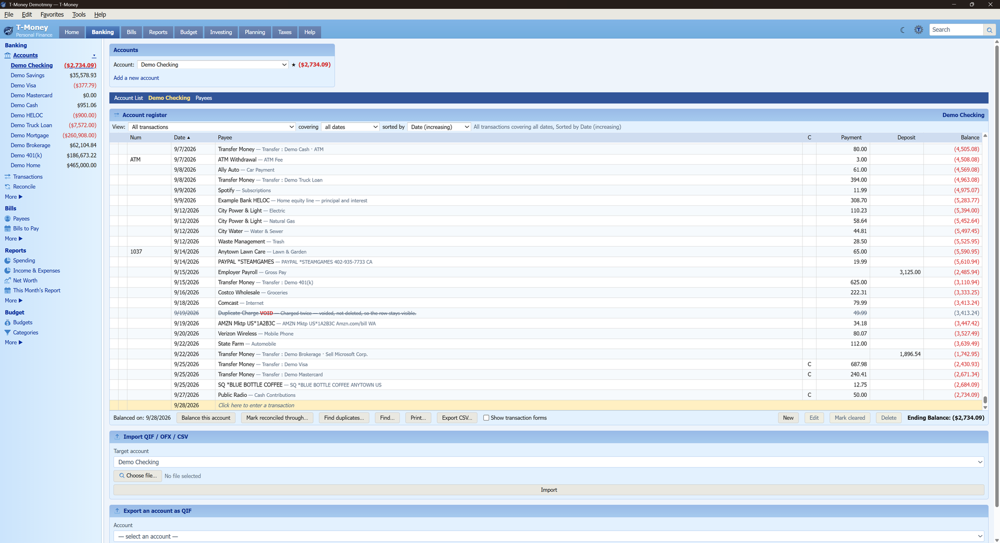
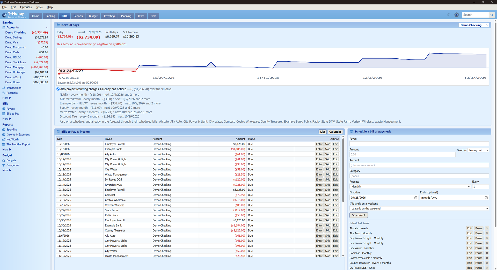
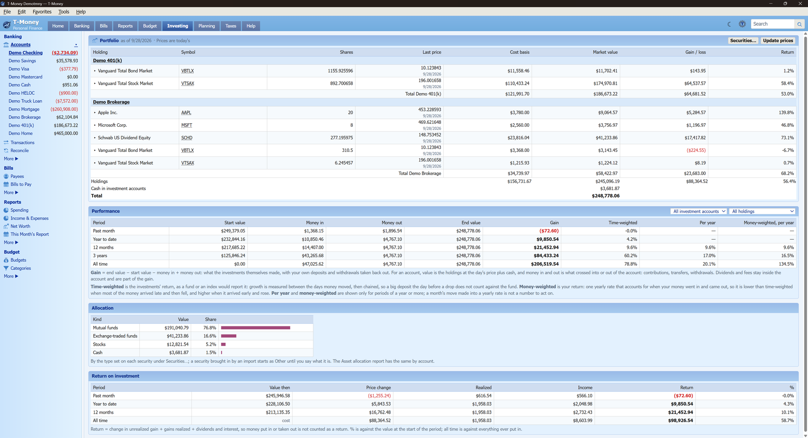
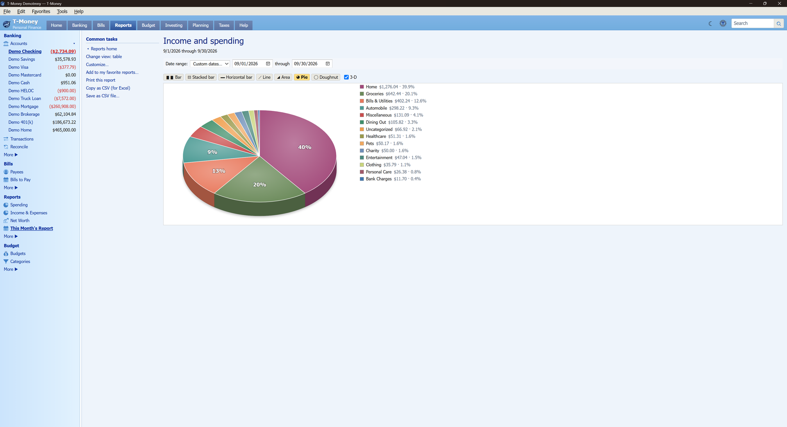
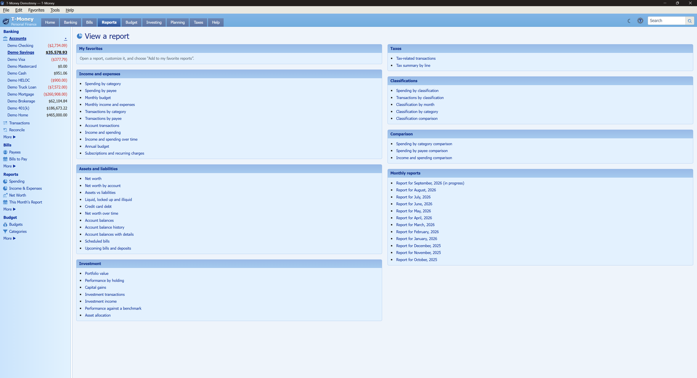
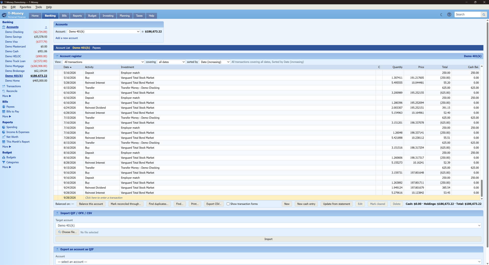
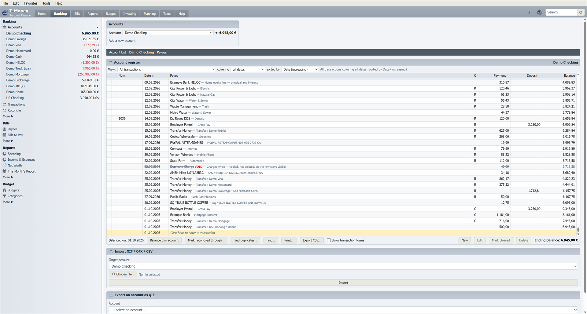
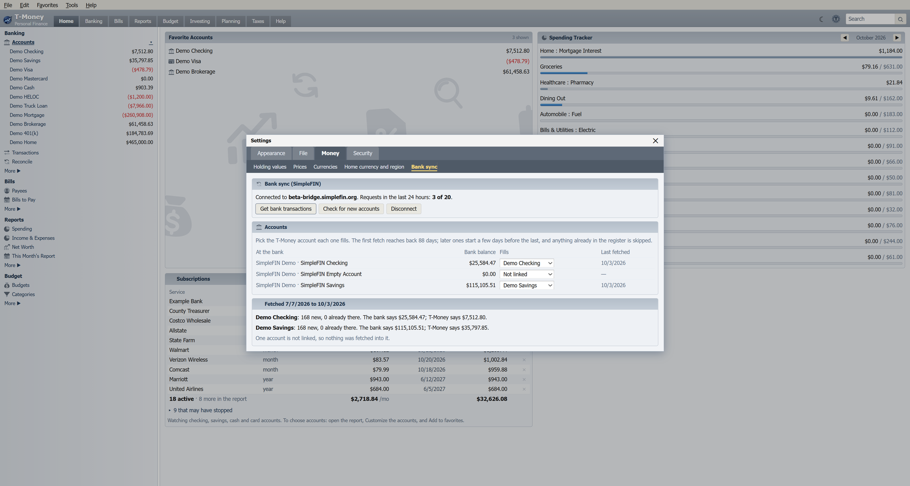

<p align="center">
  
</p>

<h3 align="center">Home finance on your own computer. One encrypted file, no account, no cloud.</h3>

<p align="center">
  <a href="https://github.com/HuskerMinion/t-money/releases/latest"></a>
  
  <a href="LICENSE"></a>
</p>

---

**T-Money** is a desktop money manager for Windows, in the spirit of Microsoft Money. Your accounts,
register, bills, budget, investments and reports live in one file on your computer, encrypted with
SQLCipher. There is no sign-in, no subscription and no server. Nothing about your money leaves the
machine. If you want your bank's transactions fetched for you, [bank sync](#bank-sync) is optional and
goes through a separate service you sign up for.

<p align="center">
  
</p>

## Screenshots

All screenshots use the made-up household in **File → New → Sample file with demo data**.

| | |
|---|---|
|  |  |
| **Bills and forecast.** Scheduled bills, paychecks and the balance they lead to. | **Investing.** Holdings, cost basis, returns and allocation. |
|  |  |
| **Charts.** Any report as a bar, line, area or pie chart. | **Reports.** Close to 40 reports, all customizable. |
|  |  |
| **Investment register.** Buys, reinvestments and employer match, share by share. | **Your currency and format.** The sample file kept in euros, written the German way, with a US-dollar account beside the others. |

## What it does

- **Accounts and the register** — checking, savings, credit cards, loans, assets and investment
  accounts. Type-ahead payees and categories, splits, linked transfers, and real Undo (Ctrl+Z) for
  almost everything.
- **Balancing** — reconcile an account against a statement, the way Money did it.
- **Bills and deposits** — scheduled payments and paychecks, a cash forecast, and subscriptions it
  notices on its own.
- **Budgets** — a monthly budget and a year plan, including Level Pay for bills that come once or
  twice a year.
- **Investments** — holdings, lots and cost basis, returns, asset allocation, and share prices
  fetched on request.
- **Loans and debt** — loan terms, payments split into principal, interest and escrow, and a
  debt reduction planner.
- **Reports and charts** — spending, income and expenses, net worth, taxes and more, all
  customizable.
- **Currencies and regions** — keep a file in US dollars, Canadian dollars, euros, British pounds,
  Mexican pesos or Australian dollars, with numbers and dates written the way your country writes
  them. An account can be kept in another of those currencies; it converts at exchange rates you
  type in or fetch.
- **Bank sync, if you want it** — fetch transactions from most US and Canadian banks through
  SimpleFIN. See [Bank sync](#bank-sync).
- **Import** — QIF from Microsoft Money (splits and transfers included), OFX and QFX from banks and
  brokers, CSV from most banks (either decimal mark), and the TSP activity file. Export a register as QIF or CSV, and any report as CSV.
- **Savings goals, classifications** (track a rental or a second house separately), attachments
  (receipts and statements kept inside the file), and built-in help.

## Bank sync

[SimpleFIN](https://bridge.simplefin.org) is a paid service (about $15 a year) that gives the apps you
choose read-only access to your bank transactions. You can turn an app off anytime. In T-Money you
pick which account each one fills. It covers most US and Canadian banks.

1. Sign up at SimpleFIN Bridge, connect your banks there, and make a setup token.
2. In T-Money, open **Settings → Money → Bank sync**, paste the token and click **Connect**.
3. Pick the T-Money account each bank account fills, then click **Get bank transactions**.

<p align="center">
  
</p>

- It fetches only when you click. The first fetch reaches back 88 days; later ones overlap the last
  by a few days, and anything already in the register is skipped.
- Transactions go through the same import as a statement file. Rename rules apply, they arrive
  cleared, and one you already typed in is matched instead of added twice. Each fetch is one Undo
  step.
- The result shows the bank's balance beside T-Money's, so a gap shows at once. SimpleFIN's own
  messages, such as a bank that needs you to sign in again, are shown as it wrote them.
- The connection is kept in the Windows Credential Manager on your computer, not in the file.
  **Disconnect** removes it. T-Money stays under SimpleFIN's daily request limit.

## Your data

- Everything is in one `.tmny` file that you choose where to keep.
- The file is encrypted. Its key is kept in the Windows Credential Manager, so it opens without a
  password on your computer. **Settings → Security → Master key** shows the key. Keep a copy somewhere safe:
  you need it to open the file or a backup on another computer.
- **Settings → File → Backups** saves copies to a folder of your choice: once a day, and if you
  choose, whenever you close the app or the file.
- Without bank sync, the only things T-Money ever sends over the internet are ticker symbols when
  you ask it to update share prices, and currency codes when you ask it for today's exchange rates
  (both from Yahoo Finance). No amounts, no account names, no account or sign-in. Prices are off
  unless you press **Update prices** or turn on the timer in Settings; exchange rates are fetched
  only when you ask for them.
- Bank sync is off until you connect it. Once connected, T-Money asks SimpleFIN for your accounts
  and transactions only when you click **Get bank transactions**, and sends nothing about your
  file. The connection is kept in the Windows Credential Manager, not in the file, and
  **Disconnect** removes it.

## Install

1. Download `T-Money_x.y.z_x64-setup.exe` from the
   [latest release](https://github.com/HuskerMinion/t-money/releases/latest). The `.msi` is the same
   app, for people who prefer an MSI.
2. Run it.

**Windows will warn you the first time.** The installer is not code-signed. A signing certificate
costs money every year, and this is a free app. Windows SmartScreen shows *"Windows protected your
PC"*. Click **More info**, then **Run anyway**.

If you want to be sure the file is the real one before you run it:

- **Check the checksum.** Each release has a `SHA256SUMS.txt`. In PowerShell:

  ```powershell
  Get-FileHash .\T-Money_1.2.0_x64-setup.exe -Algorithm SHA256
  ```

  Use the name of the file you downloaded. The hash must match the line for that file.

- **Check where it was built.** Every installer is built by GitHub from the public source in this
  repository, never on anyone's own computer, and GitHub signs a record of that. With the
  [GitHub CLI](https://cli.github.com/):

  ```powershell
  gh attestation verify .\T-Money_1.2.0_x64-setup.exe --repo HuskerMinion/t-money
  ```

## Coming from Microsoft Money

T-Money was built to replace Money Plus Sunset Deluxe. Compared with Sunset, it adds real encryption,
undo, built-in share prices, CSV import, attachments and recurring-charge detection. What it doesn't do:
open `.mny` files, sign in to your bank (Direct Connect; bank sync goes through SimpleFIN instead),
the Lifetime Planner, the tax estimator, or check printing. It handles six currencies, where Money handled dozens. **[The full side-by-side comparison](docs/money-comparison.md)**
covers both directions.

To move your data over: Money can't be read directly, but it exports each account as QIF. In Money, open an account and use
**File → Export → Loose QIF**. In T-Money, create the account first, then use
**File → Import → Bank or broker file (QIF, OFX, QFX)**. The *Import and export* page in
**Help → T-Money Help** (F1) walks through it, and
**File → New → Sample file with demo data** gives you a made-up household to try things on first.

## Building from source

You need [Node.js](https://nodejs.org/) 22, [Rust](https://rustup.rs/) (stable), and the Visual
Studio C++ build tools. The first build compiles SQLCipher and OpenSSL, and takes a while.

```powershell
npm ci
npx tauri dev      # run it
npm test           # frontend tests
cd src-tauri; cargo test   # Rust tests
npx tauri build    # installers, in src-tauri\target\release\bundle
```

Releases are built by [`.github/workflows/release.yml`](.github/workflows/release.yml) when a
`vX.Y.Z` tag is pushed.

## Status

T-Money is used every day for one household's money, and has a large test suite (about 580 Rust
tests and 1,200 frontend tests). It has not yet been used by many people. Back up your file, and
please [open an issue](https://github.com/HuskerMinion/t-money/issues) if something is wrong.

There is no Direct Connect and no mobile app. Bank sync needs SimpleFIN, a separate paid service, and
covers US and Canadian banks. The tax reports follow US tax forms.

## License

[GPL-3.0-or-later](LICENSE). T-Money is not affiliated with Microsoft. Microsoft Money is a
trademark of Microsoft Corporation.
